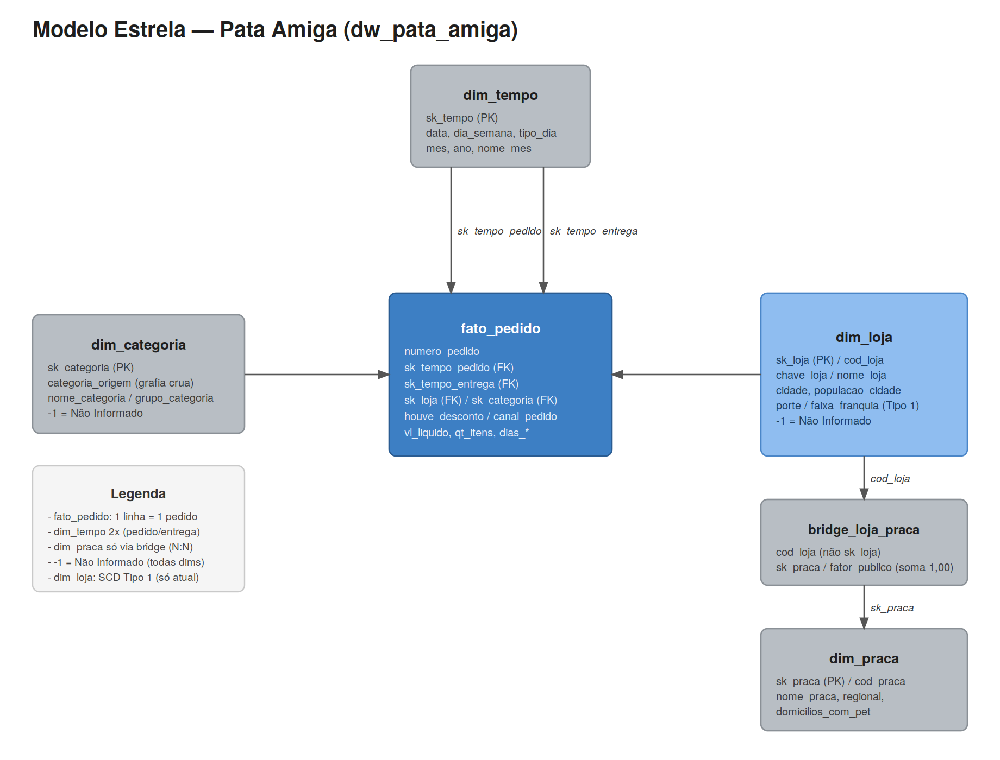

# Pata Amiga — Data Warehouse de Pedidos (Modelo Estrela)


## Objetivo

A Pata Amiga é uma rede catarinense de petshops com 32 lojas. Os dados de pedidos vêm de três sistemas que não se conversam (plataforma de e-commerce, cadastro de lojas do franchising e planilha de praças de atendimento), cada um com sua própria sujeira: grafias diferentes pra loja e categoria, datas em dois formatos, valores em texto.

Este projeto constrói um data warehouse em modelo estrela para responder cinco perguntas de negócio com número, mostrando de onde cada número veio: onde está o gargalo da entrega, qual categoria concentra o faturamento, se o desconto funciona igual em todo canal, qual praça concentra o faturamento e onde abrir a próxima loja.

## Base de Dados

Três tabelas de origem (staging), carregadas exatamente como vieram dos sistemas, sem nenhum tratamento:

| Tabela | Linhas | Origem |
|---|---|---|
| `stg_pedido` | 4.044 | plataforma de e-commerce |
| `stg_loja` | 32 | cadastro de lojas do franchising |
| `stg_loja_praca` | 48 | planilha de praças de atendimento (time de expansão) |

Duas dimensões já vêm prontas: `dim_tempo` (236 linhas) e `dim_loja` (33 linhas).

## Ferramentas

- MySQL 8.0
- MySQL Workbench
- Git / GitHub
- Excalidraw (diagrama do modelo)

## Estrutura do repositório

```
pata_amiga_dw/
├── README.md
├── sql/
│   ├── 01-carga-staging.sql        # cria o banco e carrega as 3 stg_
│   ├── 02-dimensoes-prontas.sql    # dim_tempo e dim_loja + tabelas vazias
│   ├── 03-dimensoes.sql            # dim_categoria, dim_praca, bridge_loja_praca
│   ├── 04-fato.sql                 # fato_pedido (4.044 linhas)
│   └── 05-perguntas.sql            # as 5 perguntas de negócio
└── diagrama/
    └── modelo-estrela.png
```

## Como executar (reproduzir o banco do zero)

Rode os scripts **nesta ordem exata** no MySQL 8.0:

```bash
mysql -u root -p < sql/01-carga-staging.sql
mysql -u root -p < sql/02-dimensoes-prontas.sql
mysql -u root -p < sql/03-dimensoes.sql
mysql -u root -p < sql/04-fato.sql
mysql -u root -p < sql/05-perguntas.sql
```

Cada arquivo depende do anterior. Ao final do `04`, a tabela `fato_pedido` deve ter exatamente 4.044 linhas.

## Modelo Dimensional

Esquema estrela com `fato_pedido` no centro. O grão é **uma linha por pedido**.



- `dim_tempo` é usada **duas vezes** (data do pedido e data da entrega) — a mesma dimensão em dois papéis diferentes.
- `dim_categoria` e `dim_loja` ligam direto à fato.
- `dim_praca` liga só através da `bridge_loja_praca`, porque uma loja pode atender mais de uma praça (relação N:N). A ponte guarda `cod_loja` (chave natural, não `sk_loja`) e o `fator_publico`, que sempre soma 1,00 por loja.
- Toda dimensão tem uma linha `-1 = "Nao Informado"`, inserida antes da carga real, para nenhuma FK da fato ficar nula.

## Diagnóstico da Origem (Tarefa 1)

Antes de qualquer tratamento, medimos a sujeira real da base:

| Item | Valor |
|---|---|
| Grafias distintas de `CategoriaProduto` | 18 |
| Grafias distintas de `Loja-Nome` | 50 |
| Grafias distintas de `HouveDesconto` | 12 |
| Grafias distintas de `CanalPedido` | 8 |
| Pedidos sem `Cod Loja` preenchido | 1.575 (~39%) |
| Pedidos sem `Loja-Nome` preenchido | 3 |
| `Dt Separacao Estoque` em branco | 1.077 |
| `DtNotaFiscal` em branco | 1.338 |
| `Dt_Despacho_Transportadora` em branco | 1.665 |
| `DtEntregaCliente` em branco | 1.953 |

**Achado importante:** `Cod Loja` está vazio em quase 40% dos pedidos, mas `Loja-Nome` está preenchido em praticamente todos (só 3 vazios). Por isso a fato localiza a loja pelo **nome** (com limpeza), não pelo código.

Os marcos de processo em branco não são erro de dado — são processo em aberto. A base cobre 7 meses (set/2023 a mar/2024) e o número cresce a cada etapa porque pedidos mais recentes ainda não chegaram nas etapas finais.

**Teste prático da máscara de data:** convertendo `DtHoraPedido` com a máscara americana (`%m/%d/%Y`), as 4.044 linhas convertem corretamente. Com a máscara brasileira (`%d/%m/%Y`), 1.556 linhas "convertem" mesmo assim — não porque a máscara esteja certa, mas porque sempre que o dia real do pedido é ≤12, a inversão dia/mês ainda produz um valor tecnicamente válido (só que errado, sem aviso nenhum). Esse é o erro mais caro da base: silencioso.

## Decisões Técnicas

- **De-para de categoria com ordem de prioridade:** o `CASE` testa `MED` antes de `RA`, porque "Ração Medicamentosa" contém as duas substrings e precisa cair em Medicamento, não Ração. Mesma lógica no canal: `WHATS` antes de `APP`, porque "WHATSAPP" contém "APP".
- **Localização da loja por nome, em duas camadas:** primeiro uma limpeza mecânica (`REPLACE` do sufixo "/SC" e do espaço duplo, `TRIM`, `UPPER`), depois um `CASE` manual para as 3 grafias que sobram (erro d digitação, apelido e abreviação). O acento não precisou de tratamento manual, MySQL 8 já trata `'Timbo'`, `'TIMBO'` e `'Timbó'` como o mesmo texto.
- **`vl_liquido` com duas máscaras coexistindo:** valores com "R$" usam vírgula decimal e ponto de milhar (formato brasileiro); valores sem "R$" já vêm com ponto decimal direto. `''` e `'-'` sempre viram `NULL`, nunca `0`.
- **Os 5 campos de dias usam `CASE WHEN` em vez de `NULLIF`:** durante o desenvolvimento, descobri que `NULLIF(coluna, '')` usado diretamente dentro de `DATEDIFF()` retorna sempre `NULL` nessa instalação de MySQL — um comportamento de dedução de tipo que só aparece quando as duas funções são combinadas (cada uma isolada funciona normalmente). A solução foi trocar por `CASE WHEN coluna = '' THEN NULL ELSE coluna END`, mais confiável.
- **A ponte usa `cod_loja`, não `sk_loja`:** decisão do próprio enunciado, para manter a chave natural como elo entre a fato (que localiza a loja por nome) e a dimensão de praça.

## As 5 Perguntas de Negócio

### P1 — Onde está o gargalo do processo de entrega?

| Porte | Integ.→Separ. | Separ.→Nota | Nota→Despacho | Despacho→Entrega | Total |
|---|---|---|---|---|---|
| Pequena | 3,0 | 0,7 | **8,5** | 2,9 | 15,2 |
| Média | 2,0 | 0,6 | 3,3 | 2,0 | 8,0 |
| Grande | 2,0 | 0,6 | 3,3 | 2,0 | 7,9 |

**O gargalo está nas lojas pequenas**, na etapa entre a nota fiscal e o despacho (8,5 dias contra 3,3 nas médias/grandes — quase o triplo). O total de 15,2 dias nas pequenas é quase o dobro das demais, e a diferença vem majoritariamente dessa etapa específica. O gargalo **não** é o mesmo nos três portes.

### P2 — Qual categoria concentra o faturamento?

| Categoria | Faturamento | % do total |
|---|---|---|
| Ração | R$ 1.076.203 | 60,0% |
| Medicamento | R$ 305.904 | 17,1% |
| Petisco | R$ 128.590 | 7,2% |
| Serviço | R$ 94.001 | 5,2% |
| Higiene | R$ 92.314 | 5,1% |
| Acessório | R$ 64.661 | 3,6% |
| Brinquedo | R$ 31.635 | 1,8% |

**Ração concentra 60% do faturamento**, mais que o triplo da segunda colocada. Ração e Medicamento juntas somam 77% da rede — reflexo de serem itens de recompra recorrente/necessidade básica em petshop.

### P3 — O desconto funciona igual em todo canal?

| Canal | Ticket c/ desconto | Ticket s/ desconto | Razão |
|---|---|---|---|
| Site | R$ 501,92 | R$ 189,68 | 2,65x |
| App | R$ 488,04 | R$ 167,63 | 2,91x |
| Loja Física | R$ 494,04 | R$ 197,55 | 2,50x |
| WhatsApp | R$ 514,33 | R$ 179,26 | 2,87x |
| Telefone | R$ 514,02 | R$ 195,23 | 2,63x |

**Sim, o desconto funciona de forma consistente** em todos os canais.A razão fica sempre entre 2,5x e 2,9x, sem nenhum canal fugindo do padrão. O achado maior não é a diferença entre canais, e sim que pedidos com desconto têm ticket bem maior que sem desconto em geral, sugerindo que o desconto tende a ser aplicado em compras maiores.

### P4 — Qual praça de atendimento concentra o faturamento?

| Praça | Faturamento rateado |
|---|---|
| Vale do Itajaí | R$ 633.746 |
| Grande Florianópolis | R$ 283.547 |
| Norte Industrial | R$ 175.432 |
| Litoral Sul | R$ 137.051 |
| Litoral Norte | R$ 128.873 |
| *(demais praças, ver `05-perguntas.sql`)* | |

**Vale do Itajaí concentra o faturamento**, com R$ 633.746 — mais que o dobro da segunda colocada. A soma rateada pelo `fator_publico` (R$ 1.792.322, considerando só pedidos com loja identificada) reconcilia com o faturamento total da fato.

### P5 — Onde abrir a próxima loja, e o que os dados não permitem afirmar?

**(a) Ranking por itens/mil habitantes x tempo de entrega:** cidades pequenas dominam o topo do ranking per-capita (Rio dos Cedros, 41,87 itens/mil hab.), mas a maioria tem entrega lenta (14–16 dias). **Gaspar é o destaque**: alta demanda per-capita (16,72 itens/mil hab.) combinada com entrega rápida (8,0 dias) — sinaliza um perfil de praça atrativo para expansão, com demanda comprovada e operação logística já eficiente.

**(b) Por que o faturamento por faixa de franquia não responde "quanto veio de lojas que já eram Ouro na data do pedido":** `dim_loja` é uma dimensão Tipo 1 (SCD Tipo 1) — guarda só o cadastro **atual** de cada loja, sem histórico. O JOIN associa todo pedido (mesmo os antigos) à faixa de franquia de hoje, não à faixa vigente na data daquele pedido. Para responder de verdade "por época", seria preciso uma `dim_loja` Tipo 2 (com `versao`, `dt_inicio`, `dt_fim`, `flag_atual`) e um JOIN ponto-no-tempo (`dt_pedido BETWEEN dt_inicio AND dt_fim`).

**(c) O que ficou de fora:**

| O que ficou de fora | Quantidade |
|---|---|
| Pedidos sem loja identificada | 3 |
| Entregas ainda não concluídas | 1.953 (~48%) |
| Itens em branco | 257 |
| Valor líquido em branco | 121 |

Quase metade dos pedidos ainda não teve entrega concluída dentro da janela de 7 meses — qualquer métrica de tempo de entrega reflete só quem já foi entregue, não a operação toda.

## Recomendação Final

Com base nos dados, **Gaspar** (ou praças com perfil semelhante — alta demanda per-capita já comprovada e boa performance logística) é o candidato mais sólido para a próxima loja, mais do que apenas seguir o critério de maior população absoluta. Antes de decidir, porém, vale investigar a causa do gargalo de despacho nas lojas pequenas (P1) — se a nova loja nascer pequena, corre o risco de herdar o mesmo problema logístico. Os dados **não permitem** afirmar se a faixa de franquia (Ouro/Diamante/etc.) influenciou o desempenho histórico de cada loja, porque o cadastro não preserva essa informação por período.

## Aprendizados

- A collation padrão do MySQL 8 (accent e case insensitive) elimina boa parte do trabalho manual de padronização de texto — mas só funciona se você souber que ela existe.
- Testar cada expressão isoladamente antes de juntar num `INSERT` grande economiza muito tempo de debug (aprendido na prática ao construir a fato).
- Nem toda combinação de funções SQL se comporta como esperado — `NULLIF` dentro de `DATEDIFF` foi um bom lembrete de que vale testar, não assumir.
- Média (`AVG`) ignora `NULL` automaticamente, o que é exatamente o comportamento certo para medir "tempo médio de quem já passou por aquela etapa" sem distorcer o resultado com zeros artificiais.

## Vídeo

[Link do vídeo no Google Drive]( ).

## Fonte dos Dados

Dados fictícios elaborados para fins didáticos, fornecidos no Mini-Projeto Avaliativo do Módulo 2 do curso SC TEC (SENAI SC) — Análise de Dados com Python.

## Autor

**Matheus Capri**
[LinkedIn](www.linkedin.com/in/matheus-capri-nery) · [GitHub](https://github.com/MatheusCapri)
